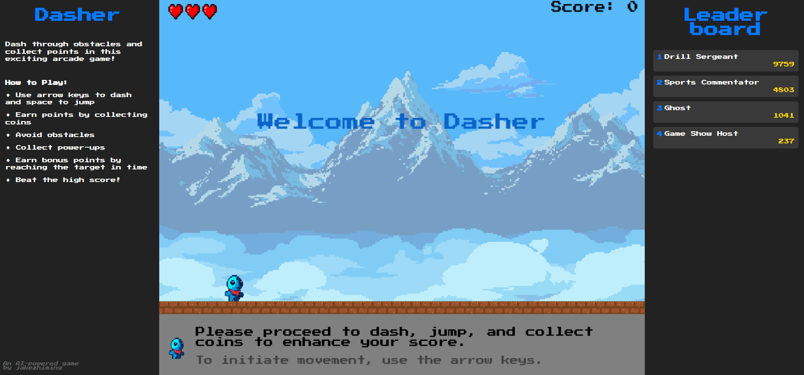

# Dasher

Dasher is an AI-powered 2D side-scrolling platformer game built with Pygame where you dash and jump through an endless procedurally generated world.

You can now play Dasher directly in your browser (web only)! 
Note: It's highly addictive - [https://jakezhiming.github.io/dasher/](https://jakezhiming.github.io/dasher/)



## Game Overview

In Dasher, you control a character that must navigate through an endless world filled with:
- Platforms to jump on
- Obstacles to avoid (spikes, fire, saws, bombs)
- Pits to cross
- Coins to collect
- Power-ups to enhance your abilities
  - Speed boost: Increases your movement speed
  - Invincibility: Makes you immune to obstacles
  - Flying: Reduces gravity and allows continuous jumping
  - Extra life: Adds an additional life

The game features:
- **Difficulty Scaling**: The game gets progressively harder the further you go, with more obstacles, wider pits, and more challenging level elements
- **AI-Powered Messages**: Game messages are rephrased by an AI in different personalities (pirate, robot, wizard, etc.) using OpenAI's GPT-4o-mini model
- **Special Animations**: Visual effects for double jumps, dashes, power-ups, and more
- **Bonus Score System**: Earn bonus points by reaching score targets within time limits
- **Leaderboard**: Track your high scores and compete with other players globally

## Controls

- **Left/Right Arrow Keys**: Move left/right
- **Space**: Jump (press again in mid-air for double jump)
- **'D' Key**: Show stats in debug mode

## Setup

### Prerequisites
1. Clone this repository: `git clone https://github.com/jakezhiming/dasher.git`
2. Ensure you have Python 3.8+ installed on your system
3. Install requirements:
   ```
   make install
   ```

### [Optional] AI Message System
To enable the AI-powered message system with different personalities:
1. Rename `.env.example` to `.env`
2. Add your OpenAI API key to the `.env` file:
   ```
   OPENAI_API_KEY=your_api_key_here
   ```
   If no API key is provided, the game will use default messages without AI rephrasing

### Desktop Setup
Run the game directly:
   ```
   make run
   ```

### Web Setup
To build and deploy the web version:

1. Run the proxy server (required for API communication):
   ```
   make proxy
   ```
   This handles the communication between the web version and OpenAI's API

2. Build the web version:
   ```
   make build
   ```
   The built files will be in the `build/web` directory

3. To test locally:
   ```
   make run-web
   ```
   Then open a browser and go to: http://localhost:8000

4. To deploy to your own website, host the proxy server and upload the contents of the `build/web` directory to your web server

## Author

- GitHub: [https://github.com/jakezhiming](https://github.com/jakezhiming)
- LinkedIn: [https://www.linkedin.com/in/jakezhiming/](https://www.linkedin.com/in/jakezhiming/)

If you enjoy playing Dasher, consider:
- ⭐ Starring the repository on GitHub
- 🐛 Reporting any bugs or issues
- 🔄 Contributing to the project
- 🎮 Sharing your high scores